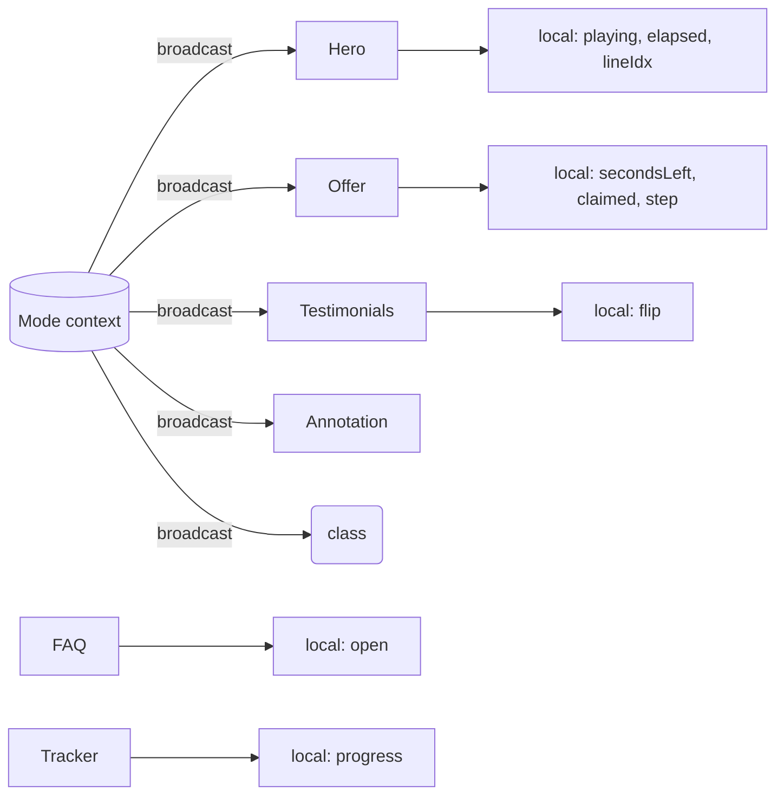
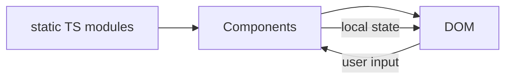

# Architecture — THE PRODUCT™

This document explains the system design of the project: how the application
is structured, how state and rendering flow, and why it is built the way it
is. It is the second rung of the documentation ladder:

```
README        → what this is and how to run it
ARCHITECTURE  → how the system fits together   (this file)
docs/technical → per-subsystem deep dives
src/          → implementation
```

## Overview

THE PRODUCT™ is a **single-page React application**. There is no backend, no
store, no router, and no build-time data fetching. Everything the visitor sees
is rendered client-side from local state and a small, static content layer.

The piece is not primarily *software that does a job*; it is *software that
performs a critique*. That framing drives several architectural decisions that
would look odd in a conventional product and are central here:

- The pattern of persuasion is built **literally** (a countdown, testimonials,
  an offer) and then **revealed** (the Critique mode) — so the same UI has to
  work as both a functioning funnel and an annotated diagram of that funnel.
- The state that manufactures urgency does not need to be "correct." The
  countdown is periodic; the claimant counter only increments; the remaining
  time is computed against a modulo window. These are *artistic* invariants,
  not bugs.

## High-level system

```mermaid
flowchart TD
    subgraph Entry
        main[main.tsx] --> App[App.tsx]
    end

    subgraph App
        MP[ModeProvider] --> Page[Page]
        Page --> Top[TopBar]
        Page --> Toggle[ModeToggle]
        Page --> Sections[Hero / Testimonials / Offer / Guarantee / FAQ / Footer]
        Page --> Tracker[SimulacraTracker]
    end

    subgraph Context
        MC[ModeContext] ---|mode: funnel | theory| MP
    end

    Sections --> useMode[useMode]
    Tracker --> SIM[lib/simulacrum.ts]

    subgraph Content
        HERO[content/hero.ts] --> Sections
        TEST[content/testimonials.ts] --> Sections
        OFFER[content/offer.ts] --> Sections
        FAQ[content/faq.ts] --> Sections
    end
```

## Application lifecycle

```mermaid
sequenceDiagram
    participant B as Browser
    participant R as React
    participant F as Fonts
    participant M as Framer Motion
    B->>R: load index.html + main.tsx
    R->>R: createRoot().render(<ModeProvider><Page/></ModeProvider>)
    R->>F: import @fontsource/* (self-hosted woff2)
    R->>R: sections mount, local state initialised
    R->>M: Hero / Annotation animate on first paint
    Note over B,R: User interacts (scroll, toggle, play, claim)
    R->>R: local state updates; Mode context broadcasts
```

## Modules

| Module | Responsibility | Path |
|---|---|---|
| `main.tsx` | Entry point; imports fonts and CSS; mounts the app. | `src/main.tsx` |
| `App.tsx` | Composes the tree, owns the grain/scanline wrapper, renders sections + tracker. | `src/App.tsx` |
| `ModeProvider` | Owns the single `Mode` value and its toggle. | `src/components/ModeProvider.tsx` |
| `mode.ts` | The context object, the `Mode` type, and the `useMode` hook. | `src/lib/mode.ts` |
| `simulacrum.ts` | The four orders + the scroll-progress→order mapping. | `src/lib/simulacrum.ts` |
| `content/*` | Static copy & data (transcript, testimonials, offer stack, FAQ). | `src/content/*` |
| Section components | One component per page section. | `src/components/*` |

## State architecture

There is exactly **one piece of global state**: the `mode`.

```ts
type Mode = "funnel" | "theory";
```

It is owned by `ModeProvider` and read by nearly every section through
`useMode()`. When it flips, the entire page re-renders — which is the
intended semantic, because flipping the toggle *should* transform the whole
piece, not a panel.

Everything else is **local-per-section state**:

- `Hero`: `playing`, `elapsed`, `lineIdx`
- `Offer`: `secondsLeft`, `claimed`, `step`
- `Testimonials` (per card): `flip`
- `FAQ`: `open`
- `SimulacraTracker`: `progress`

These are deliberately local and disposable. There is no reason to lift them —
the page does not share them, and keeping them scoped means the "persuasion
machines" can be reasoned about in isolation and, conceptually, are as
unreliable as the page intends them to be.

### State model diagram



## Rendering architecture

Rendering is **React 19 + Tailwind CSS v4** utilities, with **Framer Motion**
for the animated annotations and transcript lines. There is **no Canvas and no
WebGL** anywhere. Visual effects are pure CSS:

- A `grain` overlay — a fixed-position SVG noise image (inline, via a data URI).
- A `scanline` sweep — an animated `::after` gradient, applied to the root in
  Critique mode.
- A `glitch-flicker` keyframe — applied to testimonial text when the
  "constructed" identity is showing.
- A `pulse-glow` keyframe — on the "live" indicator dot.

The mode switch toggles the class on the root `div` and on `<main>`:

```html
<div class="min-h-screen ... scanline relative">
  <main class="... [&_img]:grayscale [&_img]:contrast-110"> <!-- theory mode -->
```

This is why the desaturation is instant and does not require any per-image JS.

## Audio architecture

There is **none** by design. The "live presentation" is visual only:

- No `<audio>` element.
- No Web Audio `AudioContext`.
- No source audio files.

The player is a *simulation of a broadcast* built from state: a running
`elapsed` clock, a cycling transcript string, and a progress bar. The
`Volume2` icon is decorative. See [`docs/technical/audio-engine.md`](docs/technical/audio-engine.md)
for a discussion of why this choice is central to the concept.

## Data architecture

All data is **static TypeScript modules** under `src/content/`:

- `hero.ts` — the transcript and the clock constants (`TOTAL_SECONDS`,
  `WINDOW_SECONDS`, `LINE_ADVANCE_MS`).
- `testimonials.ts` — the personas and their two (buyer / construction)
  identities.
- `offer.ts` — the value stack, deadline, price, claimant constants.
- `faq.ts` — the accordion items.

There are no APIs, no database, no persistence. The only "dynamic" data is
derived at runtime from local state.



## Event flow

```mermaid
sequenceDiagram
    participant U as User
    participant H as Hero
    participant O as Offer
    participant T as Tracker
    participant S as Simulacrum orders
    U->>T: scroll
    T->>T: onScroll() compute progress
    T->>S: orderIndexForProgress(progress)
    S-->>T: stage index
    T-->>U: re-render stage label + bar
    U->>H: click play
    H->>H: setPlaying(true); start 2 intervals
    H->>U: transcript cycles; clock runs
    U->>O: click claim
    O->>O: step = processing; setTimeout(done)
    O-->>U: ACCESS GRANTED
    U->>O (via Mode context): toggle Critique
    O-->>U: annotations + desaturation + reveal
```

## Build pipeline

- **TypeScript** — `tsc -b` (project references for app + node configs).
- **Vite 7** — builds `dist/` with a `base` path derived from the git remote
  (so GitHub Pages sub-path deployment works automatically).
- **Tailwind v4** — via `@tailwindcss/vite`.
- **Fonts** — `@fontsource/*` imports are bundled as per-weight `woff2` files.
- **CI / CD** — `.github/workflows/ci.yml` (lint, typecheck, build, smoke) and
  `.github/workflows/deploy-pages.yml` (build + Pages deploy).

```mermaid
flowchart LR
    TS[.ts/.tsx] -->|tsc -b| V[Vite build]
    CSS[.css + tailwind] -->|@tailwindcss/vite| V
    FONTS[@fontsource woff2] --> V
    V --> DIST[dist/]
    DIST -->|actions/deploy-pages| GH[GitHub Pages]
```

## Performance model

The performance surface is tiny because the page avoids the traditionally
heavy browsers APIs (canvas, WebGL, audio, rAF loops). The costs are:

- **Timers** — Hero (2 intervals), Offer (2 intervals). All small; on a
  background tab, browsers throttle these.
- **Framer Motion** — used for a handful of entrance/exit transitions.
- **Scroll listener** — `SimulacraTracker` uses a passive listener that only
  updates state when the browser fires a scroll event; no rAF loop.
- **Network** — one `index.html`, one JS bundle (~111 KB gzip), one CSS bundle,
  and per-weight font files. No external CDN requests at runtime.

The page is responsive from mobile to desktop; the heavy lifting is CSS grid
reflow and the fixed decorative layers.

## External dependencies

| Dependency | Role |
|---|---|
| `react` / `react-dom` | UI runtime |
| `framer-motion` | Annotation & transcript transitions |
| `lucide-react` | Icon set |
| `@tailwindcss/vite` | Tailwind v4 integration |
| `tailwindcss` | Utility CSS |
| `@fontsource/*` | Self-hosted fonts |

**Dev-only** (used by `scripts/`, not shipped): `@sparticuz/chromium`,
`puppeteer-core`, `eslint`, additional ESLint plugins, `typescript`,
`@vitejs/plugin-react`.

`react-router-dom` was an unused dependency and has been **removed** — the
page uses in-page anchors (`#offer`, `#faq`), not client-side routes.

## Major design decisions

1. **One global mode, everything else local.** The single toggle is the
   conceptual fulcrum; lifting all the "persuasion" state would imply it
   matters beyond its own section, which it deliberately doesn't.
2. **The taxonomy is a module, not copy.** `simulacrum.ts` is imported by both
   the tracker and the annotations, so the Baudrillardian structure can't
   drift between the two.
3. **Content is separated from components.** Copy and data live in
   `src/content/`; components stay structural. This makes the pieces of the
   argument easy to edit without touching layout.
4. **No audio, no canvas, no WebGL.** The performance budget is effectively
   zero, and the *absence* of real media is the point — the broadcast is
   staged, not played.
5. **The countdown is periodic, not terminating.** `DEADLINE_SECONDS` resets
   on reaching zero. This is an artistic invariant about manufactured urgency.
6. **Self-hosted fonts.** No runtime dependency on a font CDN, which also makes
   the deployed artifact self-contained and offline-friendly.

## Technical compromises & limitations

- The mode is not persisted (intentional: the page re-sells on every visit).
- The "live broadcast" is silent (intentional: it is a simulation).
- Backdrop-blur is used for the fixed chrome; where unsupported it falls back
  to a solid background.
- The scroll-to-order mapping divides the page into four equal bands; the
  bands don't correspond exactly to section boundaries, so the "stage" label
  is best read as a conceptual progression rather than a strict per-section
  indicator.
- `aria-pressed` on the mode toggle and `aria-expanded` on FAQ items are
  present; more exhaustive ARIA labeling (e.g. live-region announcements of
  stage changes) is not implemented. See the Accessibility section of README.

## Diagrams that clarify behavior

- The **state model** diagram shows the single broadcast context.
- The **data flow** diagram shows the static-content → component → DOM → state
  loop (and that nothing is persisted).
- The **event flow** sequence shows the user gestures and what they trigger.
- The **build pipeline** shows how source becomes the deployed artifact.

These are the real edges of the system — there is no hidden routing, store, or
service to draw.
