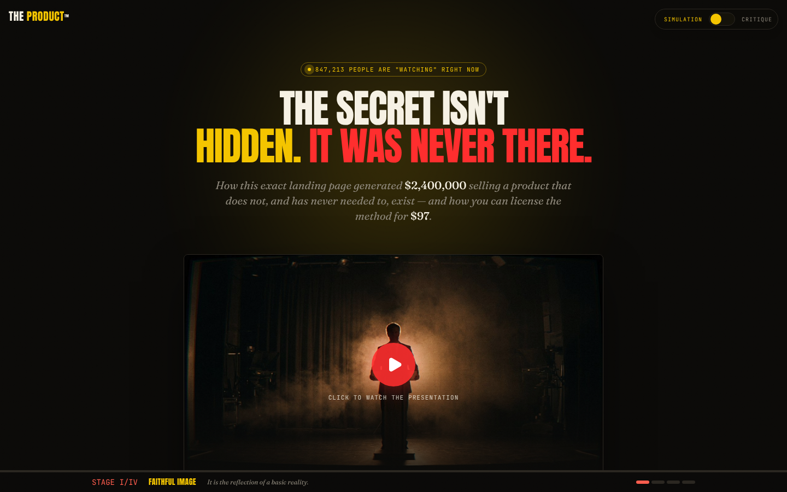

# THE PRODUCT™ — This Page Precedes It

A hyperreal landing page that sells a landing page. It is a four-stage
simulation of persuasion — built in React and TypeScript — that lets you flip
from **Simulation** (the funnel, which sells you) to **Critique** (the theory,
which shows you how it sold you).

**Created by [Zazie Productions](https://github.com/zazieproductions)**

> Click the interface below to launch the live project.

[](https://zazieproductions.github.io/Baudrillardian-Simulacra-in-Landing-Page-Conversion/)

[](https://zazieproductions.github.io/Baudrillardian-Simulacra-in-Landing-Page-Conversion/)

---

## Why this exists

This page is not a parody of a landing page. It *is* a landing page — one that
sells nothing but its own ability to sell. It implements Jean Baudrillard's
four orders of the simulacrum as a working interface:

1. **Order I — Faithful Image** — a headline that still gestures at a referent.
2. **Order II — Perversion** — a "live" presentation that is recorded, staged from state and CSS.
3. **Order III — Pretense** — testimonials from stock faces, testimonies about a product no one has received.
4. **Order IV — Pure Simulacrum** — the offer to buy the page that just sold you the page.

A **Simulation / Critique** toggle is the whole conceptual engine: flip it and
the page stops performing and starts explaining itself. Annotations fade in,
images desaturate, and every fabricated number, countdown, and identity is
revealed as a construction. The goal is that the *mechanism* of persuasion
becomes legible without losing the thing it persuades.

## Overview

| | |
|---|---|
| **Runs in** | Any modern browser (see [Browser Support](#browser-support)) |
| **State model** | One global `Mode` (`funnel` / `theory`); the rest is local section state |
| **Rendering** | React 19 + Tailwind v4; procedural motion via Framer Motion; a small SVG grain/scanline layer in CSS |
| **No audio** | The "presentation" is visual only — there is no audio track (see note below) |
| **Build** | Vite 7, TypeScript strict, self-hosted fonts |
| **Deploy** | GitHub Pages via Actions (see [Deployment](#deployment)) |

> **Audio / performance note:** the simulated "live presentation" player is
> deliberately **silent**. There is no audio track, no Web Audio graph, and no
> autoplay. The `Volume2` control is decorative — it is part of the lie the
> page performs. Nothing plays sound, on load or on interaction.

## Live Demo

Launch the project at
**[https://zazieproductions.github.io/Baudrillardian-Simulacra-in-Landing-Page-Conversion/](https://zazieproductions.github.io/Baudrillardian-Simulacra-in-Landing-Page-Conversion/)**.

[](https://zazieproductions.github.io/Baudrillardian-Simulacra-in-Landing-Page-Conversion/)

## Features

- **Four-stage simulacrum tracker** — a fixed progress dock maps scroll
  position onto `SIMULACRUM_ORDERS`, so scrolling walks you through Orders I–IV.
- **Simulated live player** — a "presentation" with a play/pause control, a
  progress bar, an elapsed/remaining readout, and a cycling transcript. The
  remaining time is `TOTAL_SECONDS - (elapsed % WINDOW_SECONDS)`, so the
  countdown never resolves to zero.
- **Simulation / Critique toggle** — globally switches the register. Critique
  reveals the production: ordering annotations, grayscale imagery, glitched
  second identities, and an "unverifiable" badge.
- **Manufactured urgency** — a countdown that resets to full on reaching zero,
  and a "people have claimed theirs" counter that only ever increments.
- **Self-referential offer** — "claim" the page and you now own the page that
  sold you the page.
- **Self-hosted fonts** — Anton, Fraunces, and JetBrains Mono are bundled via
  `@fontsource`, so there is no runtime font CDN dependency.

## Interaction / Controls

| Control | Action |
|---|---|
| **Simulation ⇄ Critique** (top-right) | Flip the register. The page re-colors, desaturates imagery, and reveals annotations. |
| **Play button** (hero) | Starts the simulated broadcast. The transcript cycles; the "remaining" clock runs. |
| **Pause / Play** (player bar) | Toggle the simulated broadcast. |
| **Claim my copy** (offer) | Runs a 1.6s "VERIFYING…" state, then an "ACCESS GRANTED" state. |
| **FAQ accordion** | Open/close each item. |
| **Scroll** | Drives the stage tracker. |

## Technical Architecture

The project is a single-page React app. The important systems:

- **State architecture** — one context value (`mode: `funnel`` \| `theory``)
  owned by `ModeProvider`. Sections read it via `useMode` and re-render. Each
  section's *persuasive* machinery (countdown, transcript cycle, claimant
  counter) is local state — deliberately not lifted, because it is meant to be
  disposable, not shared.
- **Rendering architecture** — Tailwind v4 utilities for layout and color;
  Framer Motion for the annotation and transcript transitions; CSS-drawn grain
  and scanline overlays. No canvas, no WebGL.
- **Conceptual model** — `src/lib/simulacrum.ts` is the single source of truth
  for the four orders; the tracker and the section annotations both import it,
  so the taxonomy can't drift.

For the full picture see **[ARCHITECTURE.md](ARCHITECTURE.md)**, then the
deep dives in [`docs/technical/`](docs/technical/).

## Signal Flow / Data Flow

There is a single conceptual "signal": the visitor's scroll + toggle, which is
mapped onto the four orders.

```
scroll ▸ SimulacraTracker ▸ order index (0..3) ▸ stage label + progress bar
toggle ▸ Mode context      ▸ global re-render  ▸ annotations / grayscale / badge
clock  ▸ Offer + Hero      ▸ secondsLeft & claimed (fabricated) ▸ UI
```

## Project Structure

```
.
├── .github/
│   ├── workflows/            # CI + GitHub Pages deploy
│   ├── ISSUE_TEMPLATE/
│   └── pull_request_template.md
├── docs/
│   ├── architecture/         # system-level diagrams & notes
│   ├── design/               # interface/visual-language docs
│   ├── development/          # setup, debugging, deployment
│   ├── images/               # README previews + social preview
│   └── technical/            # audio/render/state/performance deep dives
├── public/
│   ├── images/               # artwork & testimonial stock assets
│   └── favicon.svg
├── scripts/
│   ├── capture-screenshots.mjs
│   ├── build-social-preview.mjs
│   ├── smoke.mjs
│   └── lib/browser.mjs       # headless-browser bootstrap
├── src/
│   ├── components/           # each page section as a component
│   ├── content/              # copy & data (testimonials, faq, offer, hero)
│   └── lib/                  # mode context, simulacrum taxonomy
├── ARCHITECTURE.md
├── CHANGELOG.md
├── CONTRIBUTING.md
├── ROADMAP.md
├── SECURITY.md
└── package.json
```

## Installation

Requirements: **Node.js 20+** and **npm 9+**. No other system dependencies
are needed to run the app.

```bash
# clone, then:
npm install
```

## Local Development

```bash
npm run dev
```

Vite starts a dev server with HMR. There are **no required environment
variables** — the app runs out of the box. See [`.env.example`](.env.example)
for the optional ones.

Useful scripts:

| Command | What it does |
|---|---|
| `npm run dev` | Start the dev server |
| `npm run build` | Type-check + produce a production bundle in `dist/` |
| `npm run preview` | Serve the production build locally |
| `npm run lint` | Run ESLint |
| `npm run typecheck` | Run `tsc -b` |
| `npm test` | Headless-browser smoke test (builds first) |
| `npm run capture:screenshots` | Capture real screenshots to `docs/images/` |

## Production Build

```bash
npm run build
```

The build uses a `VITE_BASE`-aware base path so it deploys correctly to a
GitHub Pages sub-path. Set `VITE_BASE=/Baudrillardian-Simulacra-in-Landing-Page-Conversion/`
when building for Pages; the deploy workflow does this automatically.

## Deployment

**GitHub Pages** is the canonical target. The workflow
[`.github/workflows/deploy-pages.yml`](.github/workflows/deploy-pages.yml)
builds on `main` and deploys the `dist/` artifact via
`actions/deploy-pages`. The site resolves to:

```
https://zazieproductions.github.io/Baudrillardian-Simulacra-in-Landing-Page-Conversion/
```

Enable Pages under **Settings → Pages → Deploy from a branch** with the
`github-pages` environment, or use the **GitHub Actions** source (the workflow
publishes directly). For details see
[`docs/development/deployment.md`](docs/development/deployment.md).

## Screenshots

All screenshots are **real captures** of the running application, produced by
`npm run capture:screenshots` and committed under `docs/images/`.

| File | What it shows |
|---|---|
| `docs/images/project-preview.png` | The landing page, Simulation mode, hero visible |
| `docs/images/project-active.png` | Critique mode with the broadcast started (annotations + grayscale) |
| `docs/images/project-detail.png` | The offer section in Critique mode (Order IV) |
| `docs/images/github-social-preview.png` | 1280×640 social card |

## Design System

The visual language is an **institutional / cybernetic archive** aesthetic —
not a SaaS landing page. Key tokens live in `src/index.css`:

- **Colors** — ink `#0b0a08`, paper `#f6f1e4`, yellow `#f4c400`, red `#ff2d2d`,
  critique `#ff5c4d`, muted `#8b8578`, line `#2a2620`.
- **Typefaces** — Anton (display), Fraunces (serif/italic body), JetBrains Mono
  (interface labels). All self-hosted.
- **Texture** — a fixed SVG grain overlay and, in Critique mode, a slow
  scanline sweep and a `glitch-flicker` animation.

See [`docs/design/visual-language.md`](docs/design/visual-language.md) and
[`docs/design/interface-system.md`](docs/design/interface-system.md).

## Concept / Artistic Context

The piece is an *operative* reading of Jean Baudrillard's *Simulacra and
Simulation* (1981): instead of *describing* the hyperreal, it runs one. The
four orders are not decoration — the scroll tracker literally walks the
visitor through them, and the Simulation/Critique toggle is the moment the
simulacrum acknowledges itself. See
[`docs/design/interaction-model.md`](docs/design/interaction-model.md).

## Performance Considerations

- No audio, no WebGL, no canvas — the heaviest work is trivial: a few
  `setInterval` timers and Framer Motion transitions.
- Fonts are self-hosted and the build splits them into per-weight `woff2`
  files, loaded only as used.
- The grain overlay uses a small inline SVG so there is no network request.
- The SimulacraTracker reads scroll with a passive listener and throttles
  state updates; it does not run a rAF loop.

## Browser Support

Modern evergreen browsers: Chrome/Edge 90+, Firefox 90+, Safari 15+. The code
targets `ES2022` and uses CSS Grid, `aspect-ratio`, and `backdrop-filter`
(which degrades to a solid background where unsupported).

## Accessibility

- The Simulation/Critique toggle is a real `<button>` with `aria-pressed` and
  `aria-label`.
- FAQ items are buttons with `aria-expanded`; content is revealed with the CSS
  grid `grid-rows` technique (keyboard + screen-reader friendly markup).
- Images have descriptive `alt` text. The testimonial images use the active
  identity's name as `alt`.
- Color is not the only signal for the register change: Critique also adds
  textual annotations and a scanline treatment, so it's legible without
  relying on hue alone.

## Known Limitations

- The hero "player" is silent by design (no audio track). The volume icon is
  decorative.
- The mode is **not persisted** — a refresh returns to Simulation. This is
  intentional (the piece should re-sell you each visit), but worth flagging.
- The claim flow ("ACCESS GRANTED") is a client-side state change only; no
  data is stored or sent anywhere.
- The fabricated counters and countdowns are intentionally *non-reliably
  truthful* — that is the point, not a bug.

## Testing

See [`docs/development/testing.md`](docs/development/testing.md). In short:

```bash
npm run lint
npm run typecheck
npm run build
npm test          # headless-browser smoke test
```

## Roadmap

See **[ROADMAP.md](ROADMAP.md)** for near-term, experimental, and research
directions.

## Contributing

See **[CONTRIBUTING.md](CONTRIBUTING.md)**, and report issues via the
[`ISSUE_TEMPLATE`](.github/ISSUE_TEMPLATE/).

## License

This repository is licensed as **UNLICENSED** — all rights reserved by
Zazie Productions. There is no open-source license yet. See
[`SECURITY.md`](SECURITY.md) and the license note in [`CONTRIBUTING.md`](CONTRIBUTING.md).

## Credits

Concept, design, and implementation — **Zazie Productions**. The conceptual
framework is drawn from **Jean Baudrillard**, *Simulacra and Simulation*
(1981). Testimonial imagery consists of generated stock-style assets used as
*characters* within the piece, not real endorsements.
