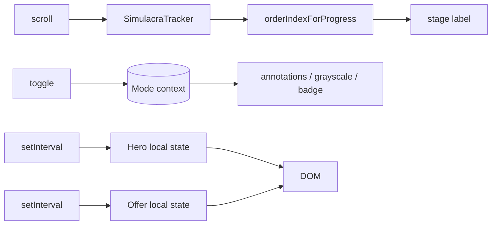

# Data flow

There is one conceptual "signal" in the whole piece, and a small amount of
derived UI state. Nothing leaves the browser.

## The conceptual signal

```
visitor scroll  ▸  SimulacraTracker  ▸  order index (0..3)  ▸  stage label + progress bar
visitor toggle  ▸  Mode context      ▸  global re-render   ▸  annotations / grayscale / badge
                  local clocks (Hero, Offer)  ▸  fabricated numbers ▸  UI
```

## Scroll → order mapping

`src/lib/simulacrum.ts` is the single source of truth:

```ts
export const SIMULACRUM_ORDERS = [ /* Order I .. IV */ ];
export function orderIndexForProgress(progress: number): number {
  const clamped = Math.min(1, Math.max(0, progress));
  return Math.min(SIMULACRUM_ORDERS.length - 1, Math.floor(clamped * SIMULACRUM_ORDERS.length));
}
```

`SimulacraTracker` reads `document.documentElement.scrollTop`, computes a
`[0,1]` progress, and passes it through `orderIndexForProgress`. The page is
divided into four equal bands. The roman numeral, the order name, and the
definition are all read from the shared module — so the tracker and the section
annotations can never disagree about what Order II is.

## Mode broadcast

The toggle writes to `ModeContext`. Every subscriber re-renders. The data that
changes depends on `mode`:

- `Annotation` renders (or not).
- `<main>` gains the `grayscale`/`contrast` classes.
- `Testimonials` shows a different identity and an "unverifiable" badge.
- The root gains the `scanline` class.

There is no fetcher, no mutation, no cache. The only store is React's own.

## Fabricated clocks

Two sections run timers whose output is intentionally unreliable:

- **Hero** — `elapsed` increments every second; the transcript cycles every
  `LINE_ADVANCE_MS`. The displayed "remaining" is
  `TOTAL_SECONDS - (elapsed % WINDOW_SECONDS)`, so it recedes toward a horizon
  that moves away as fast as it's approached.
- **Offer** — `secondsLeft` counts down from `DEADLINE_SECONDS` and resets on
  zero; `claimed` increments by a random amount every `CLAIM_TICK_MS`.

These are computed in the component, derived from local state, and never
persisted.



## No persistence

There is no `localStorage` write for any state shown above. The page does not
remember you, your mode, whether you "claimed," or your scroll position. This
is a deliberate artistic stance — the page should re-perform its offer every
time it is opened.

If a future version adds persistence (e.g. remembering Critique mode), it
should be an explicit `features/persistence` module with its own documented
trade-offs, not a `localStorage.setItem` sprinkled into a component.
